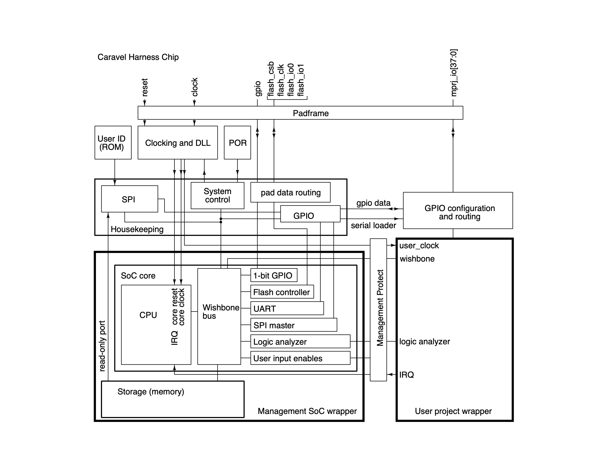

.. raw:: html

   <!---
   # SPDX-FileCopyrightText: 2020 Efabless Corporation
   #
   # Licensed under the Apache License, Version 2.0 (the "License");
   # you may not use this file except in compliance with the License.
   # You may obtain a copy of the License at
   #
   #      http://www.apache.org/licenses/LICENSE-2.0
   #
   # Unless required by applicable law or agreed to in writing, software
   # distributed under the License is distributed on an "AS IS" BASIS,
   # WITHOUT WARRANTIES OR CONDITIONS OF ANY KIND, either express or implied.
   # See the License for the specific language governing permissions and
   # limitations under the License.
   #
   # SPDX-License-Identifier: Apache-2.0
   -->

Caravel Harness
===============

|License| |Documentation Status| |Build Status|

.. note::

   Documentation for this project is being updated to reflect the changes
   for the new redesigned version of Caravel.

Table of contents
=================

-  `Overview <#overview>`__
-  `Caravel Architecture <#caravel-architecture>`__
-  `Quick Start for User Projects  <#quick-start-for-user-projects>`__

   - `Digital User Project <#digital-user-project>`__
   - `Analog User Project <#analog-user-project>`__

-  `Required Directory Structure <#required-directory-structure>`__
-  `Additional Material <#additional-material>`__

Overview
========

Caravel is a template SoC for Efabless Open MPW and chipIgnite shuttles based on the Sky130 node from SkyWater Technologies. The
current SoC architecture is given below.

Datasheet and detailed documentation exist `here <https://caravel-harness.readthedocs.io/>`__

.. include:: docs/source/getting-started.rst

.. |License| image:: https://img.shields.io/github/license/efabless/caravel
   :alt: GitHub license - Apache 2.0
   :target: https://github.com/efabless/caravel
.. |Documentation Status| image:: https://readthedocs.org/projects/caravel-harness/badge/?version=latest
   :alt: ReadTheDocs Badge - https://caravel-harness.rtfd.io
   :target: https://caravel-harness.readthedocs.io/en/latest/?badge=latest
.. |Build Status| image:: https://travis-ci.com/efabless/caravel.svg?branch=master
   :alt: Travis Badge - https://travis-ci.org/efabless/caravel
   :target: https://travis-ci.com/efabless/caravel
