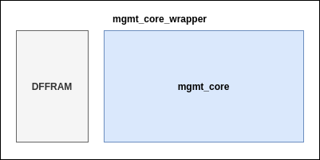
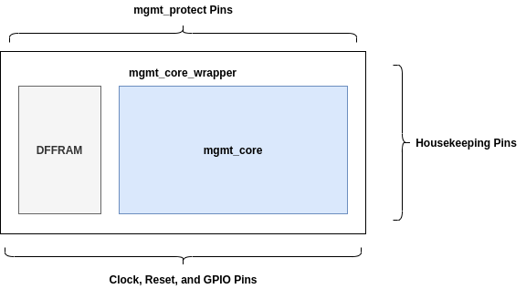
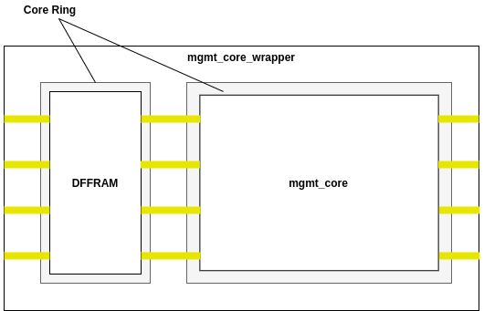

# Management Area 

The managemet area is bottom area of the caravel chip. It houses the main processor and a couple of memory blocks. The litex version is composed of four main blocks: `mgmt_core_wrapper`, `mgmt_core`, `DFFRAM`, and a `2K SRAM` block. The `mgmt_core_wrapper` is the top level block. It encapsulates two macros the `DFFRAM` and the `mgmt_core` which has the `2K SRAM` block as a submacro.  


The litex version heirarchy: 

- mgmt_core_wrapper 
    - DFFRAM
    - mgmt_core 
        - 2K SRAM

---
**NOTE**

This heirarchy is flexible to change between the different versions of the managemt area. The only restriction is that different versions of the management area conform to the same pin order, pin placement, die area, and power delivery network. 

---

# Management Core Wrapper 

This is the top level block. It encapsulates the `mgmt_core` and the `DFFRAM` and it has no standard cells on the top level. 

## Floorplan 



## Pin Placement

The pin placement is specified by a custom pin order configuration file. The pins are placed in a such away to make them align with neighboring blocks in the top level. For example, the north edge has the mgmt_protect facing pins, and the east edge has the housekeeping facing pins. 



---
**NOTE**

The clock pin is centered in the south edge of the `mgmt_core_wrapper` to be as close as possible to the `mgmt_core` and the `DFFRAM` clock pins. 

---


The managent area pins are extended with ~2 microns outside the die area. This is because the top level routing is pre-planned with one version of the managent area wrapper. In the tapeout-job, this version can be swapped with a different flavor of the mgmt_core_wrapper. To ensure that no shorts happen between the pre-planned top level signal routing and the internal `mgmt_core_wrapper` routing, it is best to connect to the `mgmt_core_wrapper` pins outside its die area. Additionally, during the top level signal routing, an obstruction is placed on the `mgmt_core_wrapper` area to prevent any top level signal routing passing through it.   

## PDN 

The wrapper PDN is planned on horizontal metal 5 stripes. The `mgmt_core` and the `DFFRAM` each has a core ring planned on metal 4 vertically and metal 5 horizontally. The top level metal 5 straps connect to the `mgmt_core` and the `DFFRAM` core ring metal 4 straps. This is done by a specifying a negative horizontal halo for the pdn by setting the following in the `mgmt_core_wrapper` config.tcl: 

```
set ::env(FP_HORIZONTAL_HALO) -6
```



---
**NOTE**

The mgmt_core and the DFFRAM have the same height, and the same pdn pitch and width to make it easier to plan the top level power routing. 


---

# Management Core

The management core (`mgmt_core`) block contains the litex generated processor and a couple of digital periphrals. It has a 2K SRAM block generated from OpenRAM as a submacro. 

## Floorplan 


## Pin Placement 

The pins are placed with a custom pin order configuration file. The pins are placed in such away that makes them aligned with neighboring blocks (`DFFRAM`) and the top level block (`mgmt_core_wrapper`) pins. For example, the DFFRAM pins are placed in the west edge and the pins that connect to the top level are placed in the east, north, and south edges.   


---
**NOTE**

The clock pin is placed in the middle of the south edge of the block. By trial, this placement gave the lowest clock skew. 

---

## PDN

The PDN is planned on metal 4 vertically and metal 5 horizontally. The block also contains a core ring on met4/met5 to enable automatic PDN generation on the top level with the negative halo method. 


## Timing Constraints 

- The `mgmt_core ` is hardened at `25 ns` (`40 MHz`). 

- The input delay for `DFFRAM` input date are manually generated by running STA on the DFFRAM block and reporting the delays on the `DFFRAM` output data through the following command: 

```
report_checks -to Do[*]
```

- The input delays coming from the `housekeeping` were also manually computed from openSTA like the `DFFRAM` . 

- The input delays coming from the user project area are set to `1ns`. This is to prevent having any hold violations on these input ports. 
 
- The reset signal is set as a false path. 

## DFFRAM 

The DFFRAM is a 1K standard cell based memory. It acts as an auxiliary memory space for the management core. 

### Floorplan 

The DFFRAM is a standard cell based block. And, it has no internal macros. 

## PDN

The PDN is planned on metal 4 vertically and metal 5 horizontally. The block also contains a core ring on met4/met5 to enable automatic PDN generation on the top level with the negative halo method. 


## Pin Placement 


---
**NOTE**

The clock pin is placed in the middle of the south edge of the block. By trial, this placement gave the lowest clock skew. 

---

## Timing Constraints

- The `DFFRAM` operates at the same clock period as the `mgmt_core`. It is hardened at `25ns` (`40 MHz`).  

- The `DFFRAM` input and output delays are set to `5ns`. This is probably an area of optimization as these delays don't match the actual delays coming from the `mgmt_core`. 

- The DFFRAM has its clock tree pre-planned in the RTL. So, in the custom sdc file, we have to specify the clock net as a propagated clock, by adding the following command: 

```
set_propagated_clock [get_clocks $::env(CLOCK_PORT)]
```

# Final Timing Signoff 

The final timing signoff on the `mgmt_core_wrapper` is done outside the openlane flow through the makefile targe `make mgmt_core_wrapper_timing`. This because as it stands today openlane doesn't support running heirarchal timing signoff. 

The method used for the timing signoff on heirarchal blocks is done as follows: 
- During physical implementation of each block, OpenLane generates a gate level netlist and a SPEF file. 
- During top level timing signoff, the gate-level netlists for all levels of heirarchy are loaded. Then, the SPEF file for each block is loaded using `read_spef -path`. 

> **_NOTE:_**  If the block is instantiated more than once, you will need to load the SPEF file for each instance. 

- After loading the needed SPEF/verilog files, STA can be perfomed.


The `mgmt_core_wrapper` timing signoff script: 

```
read_liberty <leaf cell libs>
# load verilog files
read_verilog mgmt_core.v
read_verilog DFFRAM.v
read_verilog mgmt_core_wrapper.v
link_design
# load SPEF files
read_spef -path soc/core mgmt_core.spef
read_spef -path soc/DFFRAM DFFRAM.spef
read_spef mgmt_core_wrapper.spef
# perform STA
report_checks ....
```

# Hardening the blocks with OpenLane 

We rely on this `Makefile` for running openlane. 

First, go to the openlane directory:

```
cd openlane
```

Then, set the needed environment variables: 

```
export OPENLANE_ROOT=<openlane-repo-path>
export PDK_ROOT=<pdk-installation-path>
export OPENLANE_TAG=<openlane-docker-image-tag>
```

Then, run the blocks: 

```
make DFFRAM
make mgmt_core
make mgmt_core_wrapper
```

# Improvements/Suggestions

- Increase the PDN width to avoid having IR drop. 
- Further optimize the timing for the mgmt_core.
- Update the delays in the DFFRAM macro to match the actual delays coming from the mgmt_core.  
