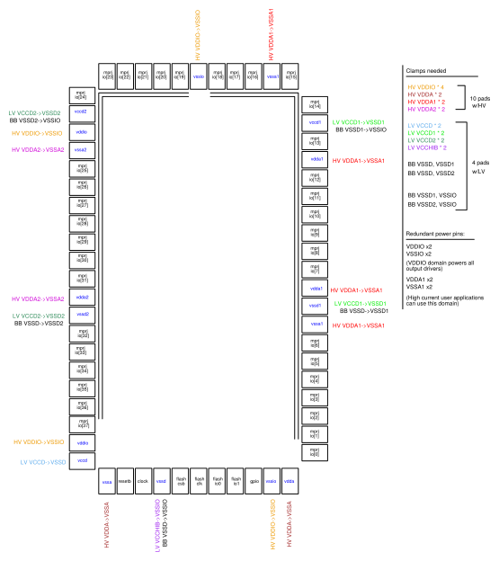
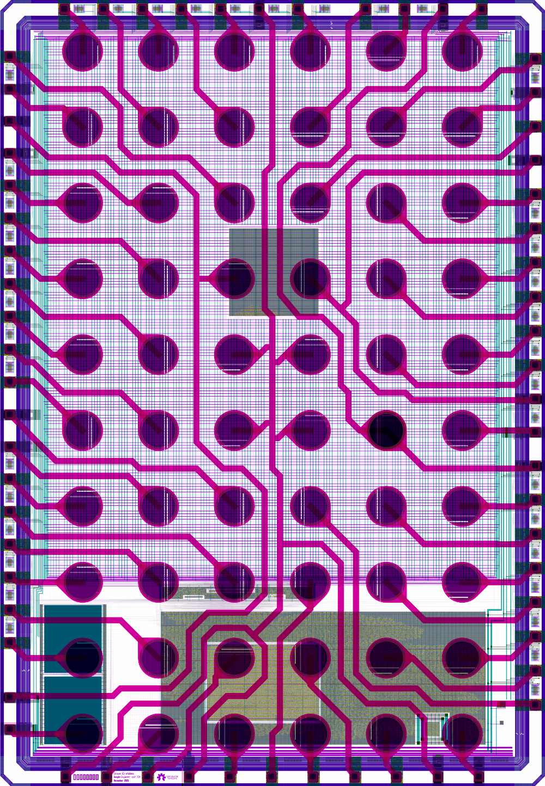
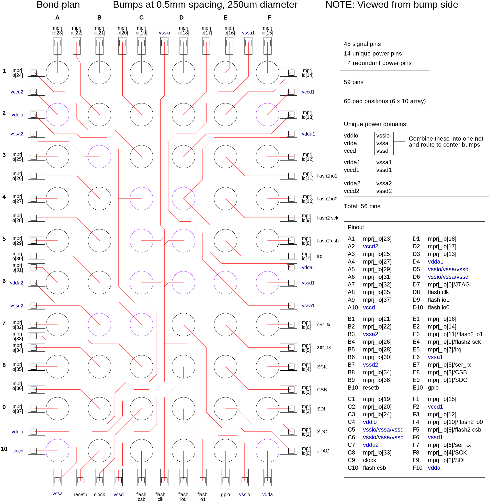
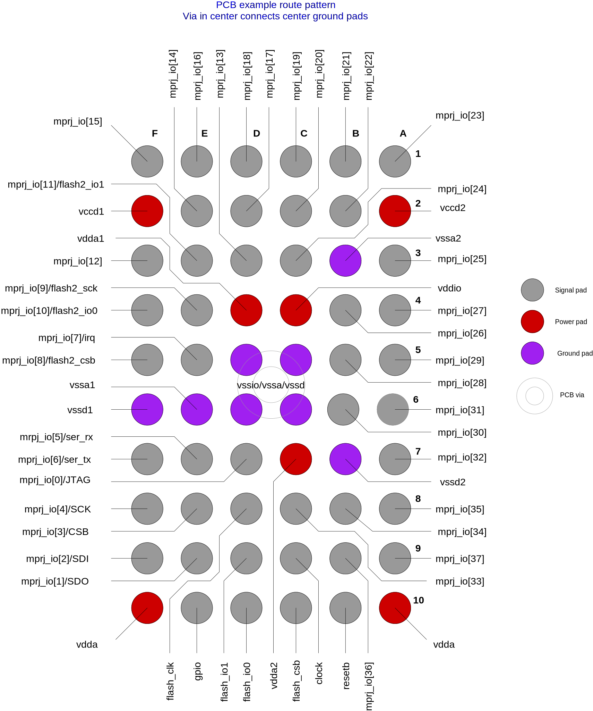

.. raw:: html

   <!---
   # SPDX-FileCopyrightText: 2020 Efabless Corporation
   #
   # Licensed under the Apache License, Version 2.0 (the "License");
   # you may not use this file except in compliance with the License.
   # You may obtain a copy of the License at
   #
   #      http://www.apache.org/licenses/LICENSE-2.0
   #
   # Unless required by applicable law or agreed to in writing, software
   # distributed under the License is distributed on an "AS IS" BASIS,
   # WITHOUT WARRANTIES OR CONDITIONS OF ANY KIND, either express or implied.
   # See the License for the specific language governing permissions and
   # limitations under the License.
   #
   # SPDX-License-Identifier: Apache-2.0
   -->

Supplementary figures
=====================

GPIO pads - management and user IO
----------------------------------

.. figure:: _static/gpio_pads.svg
      :name: gpio_pads_management_and_user_io
      :alt: GPIO pads - management and user IO
      :align: center

GPIO pad structure - pads 0 (JTAG) and 1 (SDO)
----------------------------------------------

.. figure:: _static/single_gpio_pad_structure_used_for_pad_0_and_pad_1.svg
      :name: gpio_pad_structure_pads_0_and_1
      :alt: GPIO pad structure - pads 0 (JTAG) and 1 (SDO)
      :align: center

GPIO pad structure - all pads except 0 and 1
--------------------------------------------

Die arrangement and pads
------------------------

.. figure:: _static/die_pads.svg
      :name: die_arrangement_and_pads
      :alt: Die arrangement and pads
      :align: center

Die voltage clamp arrangement
-----------------------------

Die plot 
------------------------

Die to WLCSP bond plan
------------------------

Power domain splits
-------------------

.. figure:: _static/power_domain_splits.svg
      :name: power_domain_splits
      :alt: Power domain splits
      :align: center

PCB example route pattern
-------------------------

