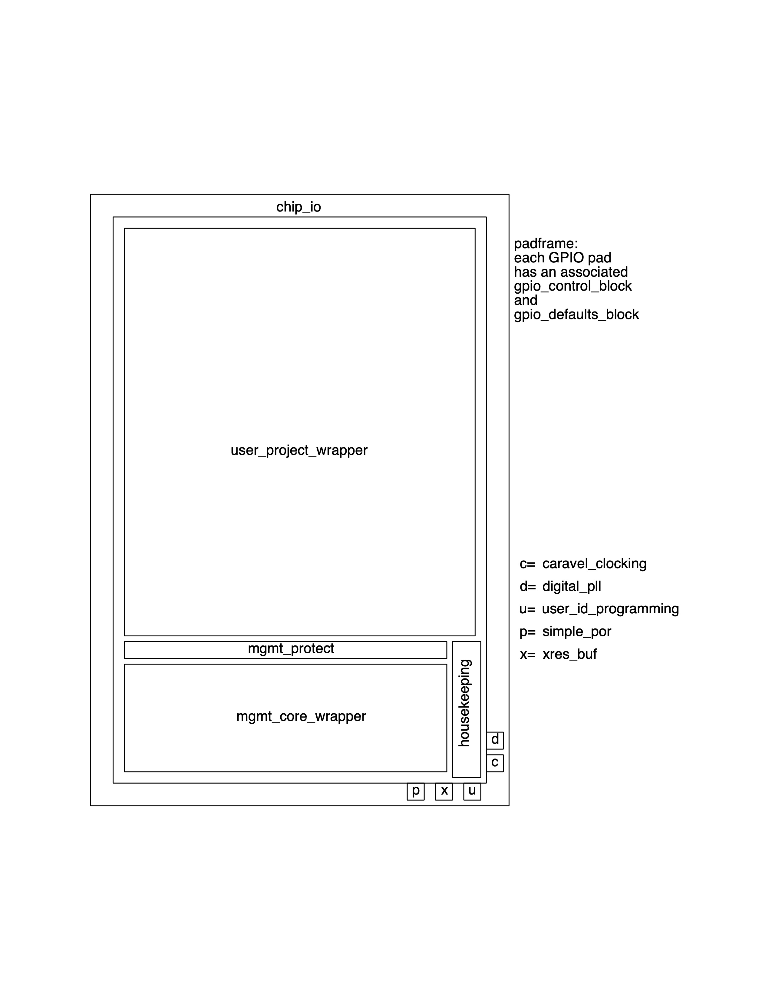

.. raw:: html

   <!---
   # SPDX-FileCopyrightText: 2020 Efabless Corporation
   #
   # Licensed under the Apache License, Version 2.0 (the "License");
   # you may not use this file except in compliance with the License.
   # You may obtain a copy of the License at
   #
   #      http://www.apache.org/licenses/LICENSE-2.0
   #
   # Unless required by applicable law or agreed to in writing, software
   # distributed under the License is distributed on an "AS IS" BASIS,
   # WITHOUT WARRANTIES OR CONDITIONS OF ANY KIND, either express or implied.
   # See the License for the specific language governing permissions and
   # limitations under the License.
   #
   # SPDX-License-Identifier: Apache-2.0
   -->

Introduction
============

The Efabless Caravel chip is a ready-to-use test harness for creating designs with the Google/Skywater 130nm Open PDK.
The Caravel harness comprises of base functions supporting IO, power and configuration as well as drop-in modules for a
management SoC core, and an approximately 3000um x 3600um open project area for the placement of user IP blocks.

      Caravel floorplan

This documentation focuses on the IO, protection and housekeeping blocks. 
The management core SoC has its own [documentation here](https://caravel-mgmt-soc-litex.readthedocs.io/en/latest/)

The Caravel Github repository can be found here: https://github.com/efabless/caravel/

The documentation contains the following chapters:

* :doc:`description` contains the general information about the Efabless Caravel "harness" SoC,
* :doc:`getting-started` contains the general information about how to use the Efabless Caravel "harness" SoC,
* :doc:`tool-versioning` contains the tool versions prefered for usage with the current Efabless Caravel "harness" SoC,
* :doc:`quick-start` contains a guide on how to get quickly started with using Efabless Caravel "harness" SoC without many details,
* :doc:`caravel-with-openlane` contains information on how to build your user project with OpenLANE inside the Efabless Caravel "harness" SoC,
* :doc:`pinout` describes the pinout of the SoC,
* :doc:`gpio` describes GPIO and its registers,
* :doc:`housekeeping-spi` describes the SPI responder that can be accessed from a remote host,
* :doc:`qspi-flash` describes the QSPI flash controller,
* :doc:`external-clock` describes  the source external clock for the CPU,
* :doc:`uart` describes the UART interface,
* :doc:`spi` describes the SPI configuration,
* :doc:`counter-timers` describes two counter/timers blocks,
* :doc:`irq` describes the interrupts,
* :doc:`sram` describes management and storage area SRAM,
* :doc:`programming` shows how to get started with programming on Caravel chip,
* :doc:`memory-mapped-io-summary` lists the memory mapped I/O registers by address,
* :doc:`supplementary-figures` provides supplementary internal structure and die arrangement figures
* :doc:`maximum-ratings` lists the parameters and their ranges at which the device operates correctly,
* :doc:`references` contains list of references,
* :doc:`further-work` lists things to be added to the documentation.
