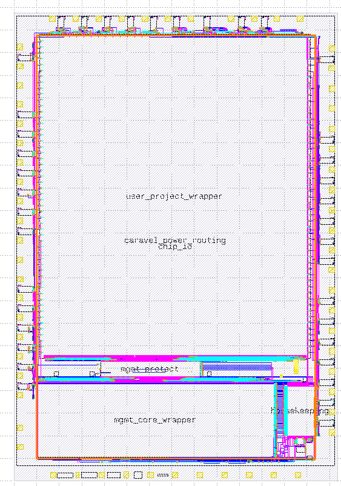
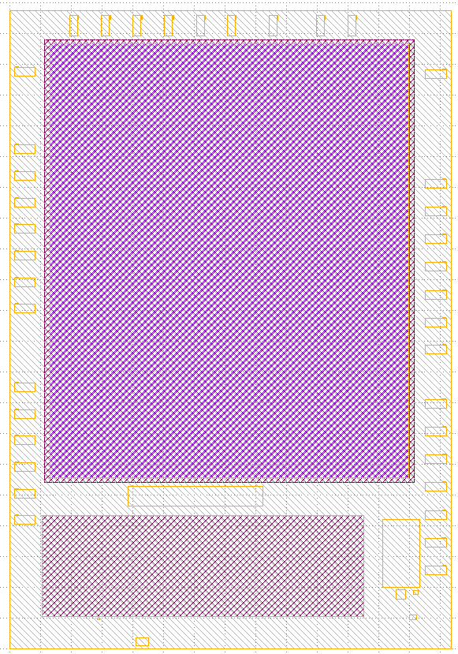
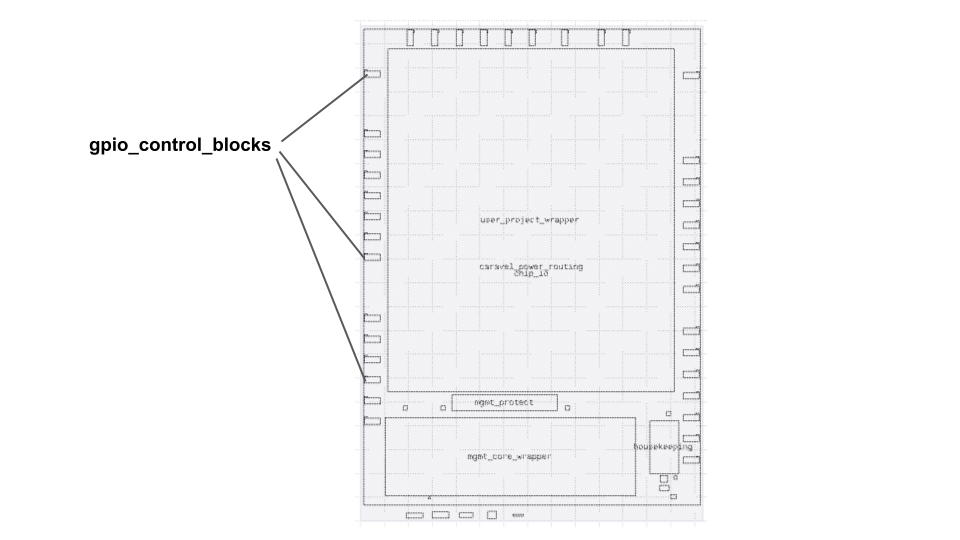
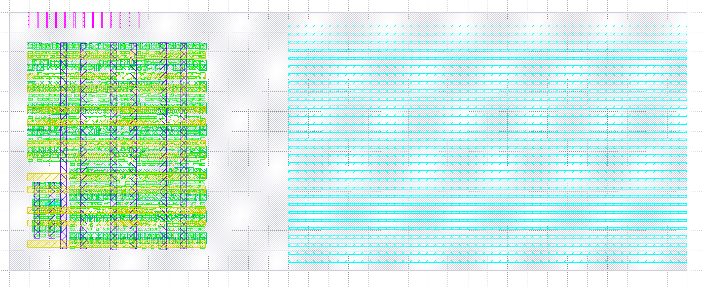
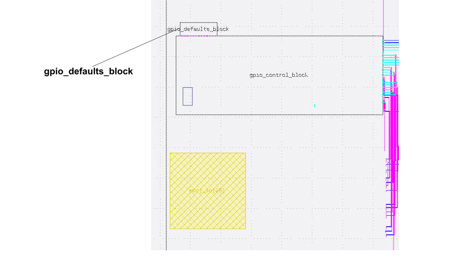
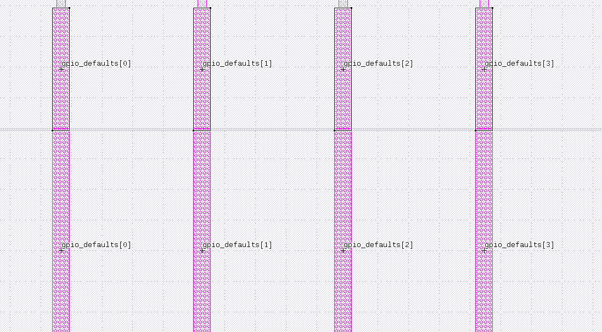
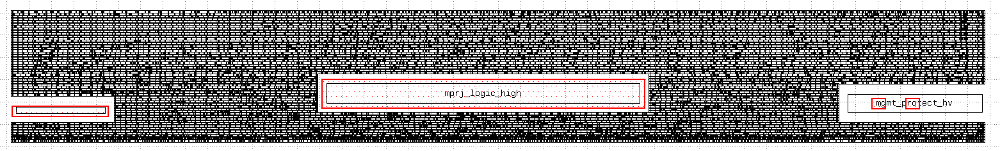
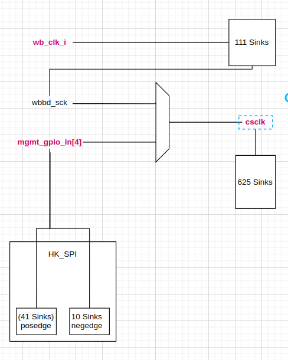
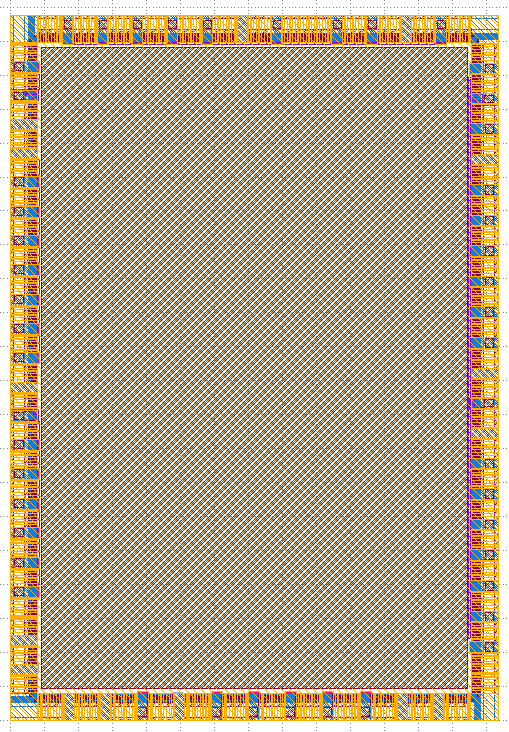

# Caravel

- Caravel top level signal routing is done by openlane. This is done through an interactive script that runs the openlane flow. 



- One prerequisite to hardening caravel with openlane is that the pad side pins have to be guarded with `ifndef TOP_ROUTING` macro. For example, the pad side power pins on the padframe are guarded as such:  

```
`ifndef TOP_ROUTING
    // Package Pins
    .vddio_pad	(vddio),		// Common padframe/ESD supply
    .vddio_pad2	(vddio_2),
    .vssio_pad	(vssio),		// Common padframe/ESD ground
    .vssio_pad2	(vssio_2),
    .vccd_pad	(vccd),			// Common 1.8V supply
    .vssd_pad	(vssd),			// Common digital ground
    .vdda_pad	(vdda),			// Management analog 3.3V supply
    .vssa_pad	(vssa),			// Management analog ground
    .vdda1_pad	(vdda1),		// User area 1 3.3V supply
    .vdda1_pad2	(vdda1_2),		
    .vdda2_pad	(vdda2),		// User area 2 3.3V supply
    .vssa1_pad	(vssa1),		// User area 1 analog ground
    .vssa1_pad2	(vssa1_2),
    .vssa2_pad	(vssa2),		// User area 2 analog ground
    .vccd1_pad	(vccd1),		// User area 1 1.8V supply
    .vccd2_pad	(vccd2),		// User area 2 1.8V supply
    .vssd1_pad	(vssd1),		// User area 1 digital ground
    .vssd2_pad	(vssd2),		// User area 2 digital ground
`endif
```

- This is because these pins don't have any physical connection to other nets. If they weren't guarded, triton-route will attempt to access and route to those pins and it will in most cases fail. 

- First, the openlane flow is ran without defining the `TOP_ROUTING` and with the `USE_POWER_PINS` macro defined. This to get a gate-level netlist with the pad side pins and the power pins. This netlist is then used for running LVS.  

```
# FOR LVS AND CREATING PORT LABELS
prep -design $script_dir -tag caravel_lvs -overwrite

set ::env(SYNTH_DEFINES) "USE_POWER_PINS"
verilog_elaborate
init_floorplan
```

- Then, the verilog elaboration and init_floorplan are ran again but this time with `TOP_ROUTING` macro defined. 

```
set ::env(SYNTH_DEFINES) "TOP_ROUTING"
verilog_elaborate
init_floorplan
```

- Before detailed routing, the following obstructions are added to prevent having shorts: 

   - metal 1, metal 2, metal 3 obstructions are placed on the user project area excluding the core ring. 
   - metal 4 metal 5 obstructions are placed on the user project area including the core ring. 
   - metal 4 and metal 5 obstructions are placed on the managent area. 




---
**NOTE**

- This run is expected to end with LVS errors because none of the blocks are connected to power routing yet. The power routing is done manually after the signal routing is done with magic. 
---

# Caravan 

The same strategy used for hardening caravel applies to caravel. The only difference between the two chips is that the use a different padframe cell and different user project wrapper. 

# GPIO Control Block

- The gpio control block controls the padframe cells. Each gpio pad has its own gpio control block. In total, there are `38` gpio control block instances in caravel. These instances are placed inside the padframe next to their respective pad. 



- The block has two power domains `vccd/vssd` `vccd1/vssd1`. To make it easier for openlane to power plan, the cells that connect to the same power domain are isolated in a submacro. For this block, we only have one cell (`gpio_logic_high`) that connects to `vccd1/vssd1` and the remaining logic connects to `vccd/vssd`.  The `gpio_logic_high` cell is isolated in a submacro `gpio_logic_high` while the remaining logic exists at the top level of the `gpio_control_block`. 

- The gpio_control_block pins are placed on the east and north edges. The east edge pins connect to the padframe and the north edge pins connect to the gpio defaults block. 



- Each gpio_control_block has a `gpio_defaults_block` placed beside it. This block connects to the north pins of the `gpio_control_block`. 



# GPIO Defaults Block

- The gpio defaults blocks contains a couple of tie cells that provide a default state for the gpio pad configurations.

- The block pins are placed in the south edge. The pins also have the same pitch as the `gpio_control_block` pins so that in the top level these pins connect by abutment with no routing in between. 



# Mgmt Protect

- The management protect block contains tri-state buffers that acts as a protection layer between the managenet area and the user project area. 

- The block has five power domains: `vccd/vssd`, `vccd1/vssd1` , `vccd2/vssd2` , `vdda1/vssa1` , `vdda2/vssa2`. To make it easier for openlane to handle the power planning, the standard cells that connect to the same power domain are grouped together in a submacro. 

- The block has three submacros: `mprj_logic_high` `mprj2_logic_high` `mgmt_protect_hv` with the following power connections: 

    - `mprj_logic_high` :  `vccd1/vssd1`
    - `mprj2_logic_high` : `vccd2/vssd2`
    - `mgmt_protect_hv` : `vccd/vssd` `vdda1/vssa1` `vdda2/vssa2`


- The standard cells at the top level of the `mgmt_protect` are connected to `vccd/vssd`.

---
**NOTE**

The openlane run for this block is expected to fail LVS with four net mismatches. These LVS errors are true errors and are happening because of a change of behavoir in the pdngen code that causes all the power domains to be shorted. (https://github.com/The-OpenROAD-Project/OpenROAD/issues/1505). For the mpw-3/mpw-4 iteration, this issue was fixed manually by removing the vias that cause the power short with magic. 

---


---
**NOTE**

The block was also hand-edited to add the iso-substrate layer around the different ground. This is to make it isolate the different grounds to prevent the extraction tool from shorting the grounds together. 



---

## mprj_logic_high

- It contains 463 tie cells that are connect to `vccd1/vssd1` cells. 

- The block has 463 output pins. There are two options for placing the pins on this macro: 

1. Using a custom pin order config file. To enable this option, uncomment this line to config.tcl: 

```
set ::env(FP_PIN_ORDER_CFG) $script_dir/pin_order.cfg
```

2. Using the contextualized IO placement.This option places the pins of the `mprj_logic_high` while taking into account the floorplan of the top level block. This option is enabled with the following two variables in the config.tcl: 

```
set ::env(FP_CONTEXT_DEF) $script_dir/../mgmt_protect/runs/mgmt_protect/tmp/floorplan/4-io.macro_placement.def
set ::env(FP_CONTEXT_LEF) $script_dir/../mgmt_protect/runs/mgmt_protect/tmp/merged_unpadded.lef
```

## mprj2_logic_high

- It contains one tie cell which is connected to `vccd2/vssd2`

## mgmt_protect_hv

- This block is hand-made with magic and has been reused since mpw-1 shuttle. 

# Digital PLL

- The digital PLL module is composed of a digital controller and ring oscillator module which is handcrafted from standard cell blocks. To prevent having any changes made to the ring oscillator module during synthesis, we turn off synth buffering, synth sizing, and the timing and design optimizations in the openlane config.tcl: 

```
set ::env(SYNTH_BUFFERING) 0
set ::env(SYNTH_SIZING) 0

set ::env(PL_RESIZER_DESIGN_OPTIMIZATIONS) 0
set ::env(PL_RESIZER_TIMING_OPTIMIZATIONS) 0
```

- The PLL controller is clocked by the ring oscillator clock output which is designed to run at `150 MHz`. In the custom SDC file, this clock is specified as follows: 

```
create_clock [get_pins {"ringosc.ibufp01/Y"} ] -name "pll_control_clock"  -period 6.6666666666667 
set_propagated_clock [get_clocks {pll_control_clock}] 

```

# Caravel Clocking

- The `caravel_clocking` module is responsible for switching between the PLL clock and the external clock coming from the pad. 

- It has three master clocks: `ext_clk` ( the external clock from the pad), `pll_clk` (pll generated clock), `pll_clk90` (pll generated clock with a 90 degree phase shift). The external clock is constrained to the maximum rate of the core clock (the clock that the managent area runs on) which is `25ns` (`40 MHZ`). The `pll_clk` and the `pll_clk90` both run up to `6.66ns` (`150 MHZ`). These constraints are specified in the `caravel_clocking` custom sdc as follows: 

```

## MASTER CLOCKS
create_clock [get_ports {"ext_clk"} ] -name "ext_clk"  -period 25
create_clock [get_ports {"pll_clk"} ] -name "pll_clk"  -period 6.6666666666667 
create_clock [get_ports {"pll_clk90"} ] -name "pll_clk90"  -period 6.6666666666667 

```

- The module has three clock switching multiplexers. 

```
assign core_ext_clk = (use_pll_first) ? ext_clk_syncd : ext_clk;
...
assign core_clk = (use_pll_second) ? pll_clk_divided : core_ext_clk;
...
assign user_clk = (use_pll_second) ? pll_clk90_divided : core_ext_clk;

```

- In the custom sdc file, each multiplexer has two generated clock statements, one for each possible mux output: 


```
#  assign core_ext_clk = (use_pll_first) ? ext_clk_syncd : ext_clk;
create_generated_clock -name core_ext_clk -source [get_ports ext_clk] -divide_by 1 [get_pins _347_/X] 
create_generated_clock -name core_ext_clk_syncd -source [get_pins _444_/Q] -divide_by 1 [get_pins _347_/X] 

# assign core_clk = (use_pll_second) ? pll_clk_divided : core_ext_clk;
create_generated_clock -name core_clk -source [get_pins _347_/X]  -divide_by 1 [get_ports core_clk] 
create_generated_clock -name core_clk_pll -source [get_pins _355_/Y]   -divide_by 1 [get_ports core_clk] 

# assign user_clk = (use_pll_second) ? pll_clk90_divided : core_ext_clk;
create_generated_clock -name user_clk -source [get_pins _347_/X]  -divide_by 1 [get_ports user_clk] 
create_generated_clock -name user_clk_pll -source [get_pins _357_/Y]   -divide_by 1 [get_ports user_clk]  
```

- Additionally, we need to set the generated clocks on each mux output as logically exclusive to tell the synthesis and timing optimization tool that only one case will happen: 

```
set_clock_groups -logically_exclusive -group core_ext_clk -group core_ext_clk_syncd
set_clock_groups -logically_exclusive -group core_clk -group core_clk_pll
set_clock_groups -logically_exclusive -group user_clk -group user_clk_pll

```

# Housekeeping

- The housekeeping module is one the more complex block to handle with openlane as it has three different clocks. The following diagram shows the three clocks: `wb_clk_i` `csclk` `mgmt_gpio_in[4]`. 



- The `wb_clk_i` is the same clock that the managent area operates on and it is set to `25 ns` in the housekeeping custom sdc file. The `mgmt_gpio_in[4]` is the SPI clock which is a very slow clock and it is set to `100ns`. 

```
create_clock [get_ports {"wb_clk_i"} ] -name "wb_clk_i"  -period $::env(WB_CLK_PERIOD)
...
create_clock [get_ports {"mgmt_gpio_in[4]"} ] -name "mgmt_gpio_in"  -period $::env(SCK_CLK_PERIOD)
```

- The housekeeping module has clock switching multiplexers. For example: 

```
assign csclk = (wbbd_busy) ? wbbd_sck : ((spi_is_active) ? mgmt_gpio_in[4] : 1'b0);

```
In the custom SDC file, `csclk` is specified as a generated clock with two possible configuration fast/slow depending on the mux output: 

```
create_generated_clock -name "csclk_fast" -source [get_pins {"_9640_/Q"}]  -divide_by 1 [get_pins {"_8847_/X"} ] 
create_generated_clock -name "csclk_slow" -source [get_ports {"mgmt_gpio_in[4]"} ] -divide_by 1 [get_pins {"_8847_/X"} ] 
```

Becuase the mux output can only hold one generated clock, we need to specify these two clocks as logically exclusive to tell the synthesis/timing analysis tools that these clocks won't happen at the same time: 

```
set_clock_groups -logically_exclusive -group csclk_fast -group csclk_slow
```

- The reset signals are set as a false paths.

```
## FALSE PATHS
set_false_path -from [get_ports $::env(RESET_PORT)]
set_false_path -from [get_ports "porb"]
```

# Chip IO

The `chip_io` is the padframe for caravel. The pad cells order and spacing is specified with the a custom configuration file: 

```
AREA 3588 5188 ;

CORNER mgmt_corner\[0\] SW sky130_ef_io__corner_pad ;
CORNER mgmt_corner\[1\] SE sky130_ef_io__corner_pad ;
CORNER user1_corner NE sky130_ef_io__corner_pad ;
CORNER user2_corner NW sky130_ef_io__corner_pad ;

SPACE 176 ;
PAD mprj_pads.area2_io_pad\[4\] N sky130_ef_io__gpiov2_pad_wrapped ;
SPACE 177 ;
PAD mprj_pads.area2_io_pad\[3\] N sky130_ef_io__gpiov2_pad_wrapped ;
SPACE 177 ;
PAD mprj_pads.area2_io_pad\[2\] N sky130_ef_io__gpiov2_pad_wrapped ;
SPACE 177 ;
PAD mprj_pads.area2_io_pad\[1\] N sky130_ef_io__gpiov2_pad_wrapped ;
SPACE 178 ;
PAD mprj_pads.area2_io_pad\[0\] N sky130_ef_io__gpiov2_pad_wrapped ;
SPACE 177 ;
PAD mgmt_vssio_hvclamp_pad\[1\] N sky130_ef_io__vssio_hvc_clamped_pad ;
SPACE 0 ;
......
```

- Like Caravel top level, the padframe should have `ifndef TOP_ROUTING` guard on the pad facing pins. 

- Before detailed routing, obstructions on most of the core are placed to prevent having signal routing in the middle because this space will be occupied by the managent area, user project area, and remaining caravel blocks. 



# Chip IO ALT

The `chip_io_alt` is the padframe for caravan. It follows the same strategy used to the `chip_io` module.  

# Final Timing Signoff 

- The final timing signoff is done with the following three top level makefile targets.

```
# Run at the typical corner
make caravel_timing_typ
# Run at the slowest corner
make caravel_timing_slow
# Run at the fastest corner
make caravel_timing_fast
```

# Final Timing Signoff 

- The final timing signoff is done with the following three top level makefile targets.

```
# Run at the typical corner
make caravel_timing_typ
# Run at the slowest corner
make caravel_timing_slow
# Run at the fastest corner
make caravel_timing_fast
```

# Improvements/Suggestions

- Re-consider the clock pin location in the user project wrapper. Placing it in the middle of the south edge of the wrapper will reduce the clock skew and will help users achieve timing closure. 

- Take into consideration the top level power routing shapes during detailed routing to prevent manually editing the signals that overlap with power routing. 

# Issues to Look for 

- Avoid long li1 routing.
- Avoid buffers after tri-state cells.
- Avoid using DEF templates until the openlane script is fixed. This was the cause of the unconnected clock and reset pin in mpw-1. 
- Triton route could create shorts inside the cell which aren't caught by blackbox LVS and are caught by transistor level LVS. 
