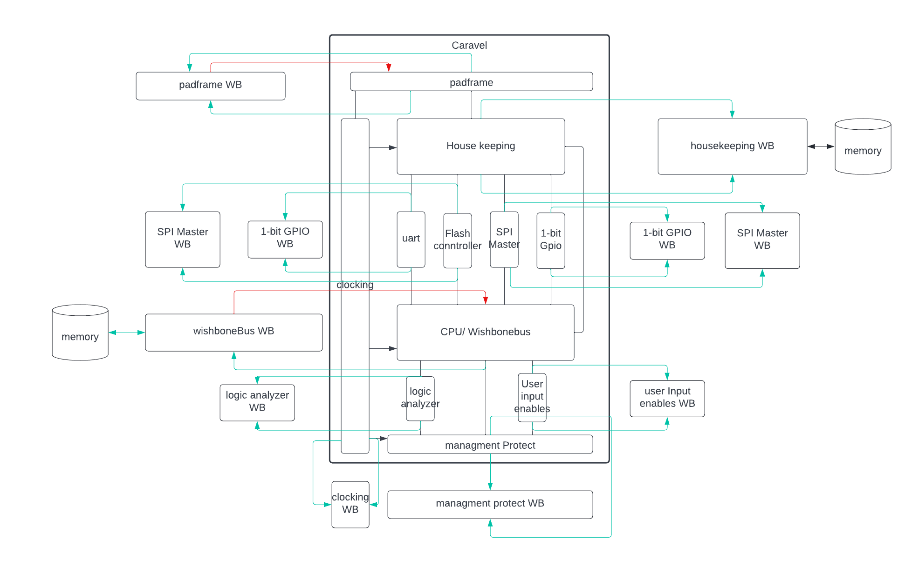

Overview
========
Cocotb environment (CTN) is a dynamic simulation testing environment. It's purpose is to speed testing simulation time and get coverage data. The environment is developed using cocotb, an open source coroutine-based co simulation testbench environment for verifying VHDL and SystemVerilog RTL using Python. CTN has 2 main layers: tests and  whitebox models. Tests layer contain multiple tests and sequences that can communicate with the caravel (dut)  through drivers shown in read at fig 1. Whitebox models layer contain multiple models that should mimic the behavior of each main block inside caravel see fig1. Model is supposed to check if the model is working as expected, if its registers contain the expected values all the time and report coverage of features provided by this block if it’s tested or not. 


 

fig1. caravel testbench environment (read lines are drivers )

Prerequisites
=============================

- Docker: [Linux](https://hub.docker.com/search?q=&type=edition&offering=community&operating_system=linux&utm_source=docker&utm_medium=webreferral&utm_campaign=dd-smartbutton&utm_location=header) ||  [Windows](https://desktop.docker.com/win/main/amd64/Docker%20Desktop%20Installer.exe?utm_source=docker&utm_medium=webreferral&utm_campaign=dd-smartbutton&utm_location=header) || [Mac with Intel Chip](https://desktop.docker.com/mac/main/amd64/Docker.dmg?utm_source=docker&utm_medium=webreferral&utm_campaign=dd-smartbutton&utm_location=header) || [Mac with M1 Chip](https://desktop.docker.com/mac/main/arm64/Docker.dmg?utm_source=docker&utm_medium=webreferral&utm_campaign=dd-smartbutton&utm_location=header)
- Python 3.6+ with PIP
- cocotb 
```
  apt update && apt install python3 python3-pip
  pip3 install cocotb
  pip3 install cocotb_coverage
  pip3 install coverage
  pip3 install cocotb-bus
```
- iverilog or vcs 

run a test  
=============================

 Use script verify_cocotb.py

```
  -h, --help            show this help message and exit
  
  -regression REGRESSION, -r REGRESSION
                        name of regression can found in tests.json
                        
  -test TEST [TEST ...], -t TEST [TEST ...]
                        name of test if no --sim provided RTL will be run
                        <takes list as input>
                        
  -sim SIM [SIM ...]    Simulation type to be run RTL,GL&GL_SDF provided only
                        when run -test <takes list as input>
                        
  -testlist TESTLIST, -tl TESTLIST
                        path of testlist to be run
                        
  -tag TAG              provide tag of the run default would be regression
                        name and if no regression is provided would be
                        run_<random float>_<timestamp>_
                        
  -maxerr MAXERR        max number of errors for every test before simulation
                        breaks default = 3
                        
  -vcs, -v              use vcs as compiler if not used iverilog would be used
                        
```


Tests 
===============

Refer to [tests.json](tests.json) for tests list

Directories names fixed for now
===============
>repo
>>caravel_mgmt_soc_litex/

>>caravel
>>>verilog
>>>>dv
>>>>cocotb

cocotb directory tree
===============
```
├── caravel.py -> contains driving and mentoring functions for caravel interface
├── caravel_top.sv -> testbench top level 
├── cpu.py -> contains driving and mentoring functions for wishbone when disable the cpu 
├── hex_files -> folder that contains hex files 
├── verify_cocotb.py -> script that run tests and regressions 
├── sim ->  directory get generate when run a test
│   └── <tag> -> tag of the run  
│       ├── <sim type>-<test name> -> test result directory contain all logs and wave related to the test
│       ├── command.log -> command use for this run 
│       └── runs.log -> contains status of the run fails and passes tests 
├── tests -> directory contains all the tests 
├── tests.json -> test list have all the tests, regressions and contain small description about every test 
└── wb_models -> contains checkers and models for some caravel blocks 

```
